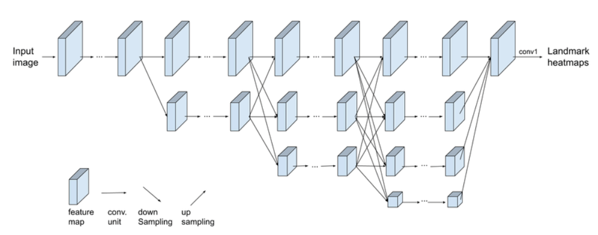

# Water-HRNet: 

- A deep Network for surface water mapping .
- Just a binary classification problem. Water or Not Water.
- Since the training dataset used is too small, the effect of the model is not guaranteed, it is only used to complete my coursework.

## -- Model
- We use HRNet as the main model structure. And only a little change added. 
- Only added an upsampling operation before the last layer, in order to refine the results
  

## -- Dataset and Pretrained Model
- We use the Sentinel-2 image dataset from [**[WatNet]**](https://github.com/xinluo2018/WatNet). Download from [**[Link]**](https://doi.org/10.5281/zenodo.5205674).
- Downloading the trained model from  [**[Google Drive]**](https://drive.google.com/file/d/1jR0nSqghfQ8Wn4-GhSMpVPLb-GUGNRdc/view?usp=sharing) [**[BaiduNetDisk]**](https://pan.baidu.com/s/1p3-OjaVGnYUu5ElPAhlGNg) code：1111
- The trained model performance:


| Acc           |                    mIoU |          fwIoU |
| ------------- | ----------------------- | -------------- |
| 0.9757        | 0.9323                  | 0.9528         |

## **-- Simple Use**

### -- Step 1
- clone the rep
~~~console
git clone https://github.com/faye0078/LULC
~~~
- Install dependence
```
cv2
gdal
matplotlib
numpy
tqdm
Pillow
torch
torchvision
```

### -- Step 2
- Download Sentinel-2 images, and select these six bands. You can also use the other image has same bands(such as landset). 

| Band          | Central Wavelength (µm) | Resolution (m) |
| ------------- | ----------------------- | -------------- |
| Band 2 – Blue | 0.490                   | 10             |
|Band 3 – Green	|0.560	|10	|
|Band 4 – Red	|0.665	|10	|
|Band 8 – NIR	|0.842	|10	|
|Band 11 – SWIR	|1.610	|20 |
|Band 12 – SWIR	|2.190	|20 |	

- Download the trained model, and move it in dir saved_model.

### -- Step 3

- change the input_path and the output_path in test.py
- run the test.py
~~~console
python test.py
~~~

## **-- Train the model**

- download the  Sentinel-2 image dataset, and move it in dir dataset.
- change the config.py based on your computer.
- run the train.py
~~~console
python train.py
~~~

## -- Acknowledgement  
- We thanks the authors for providing some of the code in this repo:  
[HRNet](https://github.com/HRNet/HRNet-Semantic-Segmentation) and [WatNet](https://github.com/xinluo2018/WatNet)  
- We use the HRNet model code from the former, and use the readTiff, cutImg code from the latter.

